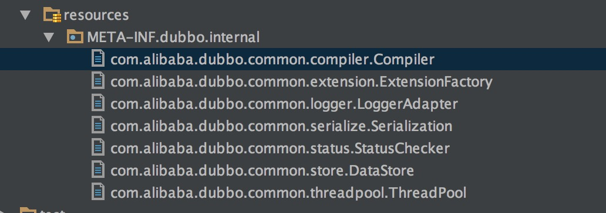
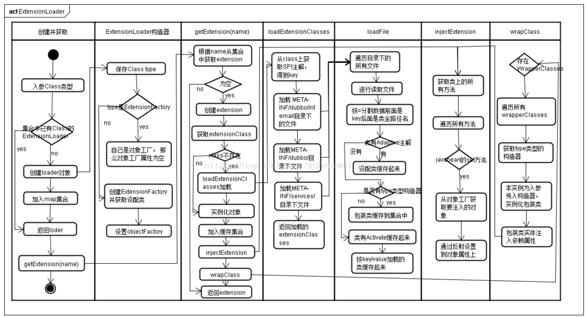

## dubbo架构学习-SPI机制

### dubbo 框架

github 地址: ```https://github.com/alibaba/dubbo``` ， dubbo是一款rpc框架也包含服务治理方面的功能。

### dubbo SPI机制

dubbo SPI 是基于jdk SPI(service provider interface)做的dubbo 扩展机制,
```@SPI```, ```@Adaptive```注解, 由```ExtensionLoader```来加载扩展, 通过方法```loadExtensionClasses```来加载dubbo路径下面的dubbo文件:



里面的的配置文件内容

```java
adaptive=com.alibaba.dubbo.common.compiler.support.AdaptiveCompiler
jdk=com.alibaba.dubbo.common.compiler.support.JdkCompiler
javassist=com.alibaba.dubbo.common.compiler.support.JavassistCompiler
```

```ExtensionLoader```来加载这些扩展类, 这种机制比较类似Spring的IOC机制

```java
  private void loadFile(Map<String, Class<?>> extensionClasses, String dir) {
        String fileName = dir + type.getName();
        try {
            Enumeration<java.net.URL> urls;
            ClassLoader classLoader = findClassLoader();
            if (classLoader != null) {
                urls = classLoader.getResources(fileName);
            } else {
                urls = ClassLoader.getSystemResources(fileName);
            }
            if (urls != null) {
                while (urls.hasMoreElements()) {
                    java.net.URL url = urls.nextElement();
                    try {
                        BufferedReader reader = new BufferedReader(new InputStreamReader(url.openStream(), "utf-8"));
                        try {
                            String line = null;
                            while ((line = reader.readLine()) != null) {
                                final int ci = line.indexOf('#');
                                if (ci >= 0) line = line.substring(0, ci);
                                line = line.trim();
                                if (line.length() > 0) {
                                    try {
                                        String name = null;
                                        int i = line.indexOf('=');
                                        if (i > 0) {
                                            name = line.substring(0, i).trim();
                                            line = line.substring(i + 1).trim();
                                        }
                                        if (line.length() > 0) {
                                            Class<?> clazz = Class.forName(line, true, classLoader);
                                            if (! type.isAssignableFrom(clazz)) {
                                                throw new IllegalStateException("Error when load extension class(interface: " + type + ", class line: " + clazz.getName() + "), class " + clazz.getName() + "is not subtype of interface.");
                                            }
                                            if (clazz.isAnnotationPresent(Adaptive.class)) {
                                                if(cachedAdaptiveClass == null) {
                                                    cachedAdaptiveClass = clazz;
                                                } else if (! cachedAdaptiveClass.equals(clazz)) {
                                                    throw new IllegalStateException("More than 1 adaptive class found: "
                                                            + cachedAdaptiveClass.getClass().getName()
                                                            + ", " + clazz.getClass().getName());
                                                }
                                            } else {
                                                try {
                                                    clazz.getConstructor(type);
                                                    Set<Class<?>> wrappers = cachedWrapperClasses;
                                                    if (wrappers == null) {
                                                        cachedWrapperClasses = new ConcurrentHashSet<Class<?>>();
                                                        wrappers = cachedWrapperClasses;
                                                    }
                                                    wrappers.add(clazz);
                                                } catch (NoSuchMethodException e) {
                                                    clazz.getConstructor();
                                                    if (name == null || name.length() == 0) {
                                                        name = findAnnotationName(clazz);
                                                        if (name == null || name.length() == 0) {
                                                            if (clazz.getSimpleName().length() > type.getSimpleName().length()
                                                                    && clazz.getSimpleName().endsWith(type.getSimpleName())) {
                                                                name = clazz.getSimpleName().substring(0, clazz.getSimpleName().length() - type.getSimpleName().length()).toLowerCase();
                                                            } else {
                                                                throw new IllegalStateException("No such extension name for the class " + clazz.getName() + " in the config " + url);
                                                            }
                                                        }
                                                    }
                                                    String[] names = NAME_SEPARATOR.split(name);
                                                    if (names != null && names.length > 0) {
                                                        Activate activate = clazz.getAnnotation(Activate.class);
                                                        if (activate != null) {
                                                            cachedActivates.put(names[0], activate);
                                                        }
                                                        for (String n : names) {
                                                            if (! cachedNames.containsKey(clazz)) {
                                                                cachedNames.put(clazz, n);
                                                            }
                                                            Class<?> c = extensionClasses.get(n);
                                                            if (c == null) {
                                                                extensionClasses.put(n, clazz);
                                                            } else if (c != clazz) {
                                                                throw new IllegalStateException("Duplicate extension " + type.getName() + " name " + n + " on " + c.getName() + " and " + clazz.getName());
                                                            }
                                                        }
                                                    }
                                                }
                                            }
                                        }
                                    } catch (Throwable t) {
                                        IllegalStateException e = new IllegalStateException("Failed to load extension class(interface: " + type + ", class line: " + line + ") in " + url + ", cause: " + t.getMessage(), t);
                                        exceptions.put(line, e);
                                    }
                                }
                            } // end of while read lines
                        } finally {
                            reader.close();
                        }
                    } catch (Throwable t) {
                        logger.error("Exception when load extension class(interface: " +
                                            type + ", class file: " + url + ") in " + url, t);
                    }
                } // end of while urls
            }
        } catch (Throwable t) {
            logger.error("Exception when load extension class(interface: " +
                    type + ", description file: " + fileName + ").", t);
        }
    }
```
  扩展机制也实现了一个小的依赖注入功能
```java
private T injectExtension(T instance) {
        try {
            if (objectFactory != null) {
                for (Method method : instance.getClass().getMethods()) {
                    if (method.getName().startsWith("set")
                            && method.getParameterTypes().length == 1
                            && Modifier.isPublic(method.getModifiers())) {
                        Class<?> pt = method.getParameterTypes()[0];
                        try {
                            String property = method.getName().length() > 3 ? method.getName().substring(3, 4).toLowerCase()
                                    + method.getName().substring(4) : "";
                            Object object = objectFactory.getExtension(pt, property);
                            if (object != null) {
                                method.invoke(instance, object);
                            }
                        } catch (Exception e) {
                            logger.error("fail to inject via method " + method.getName()
                                    + " of interface " + type.getName() + ": " + e.getMessage(), e);
                        }
                    }
                }
            }
        } catch (Exception e) {
            logger.error(e.getMessage(), e);
        }
        return instance;
    }
```



