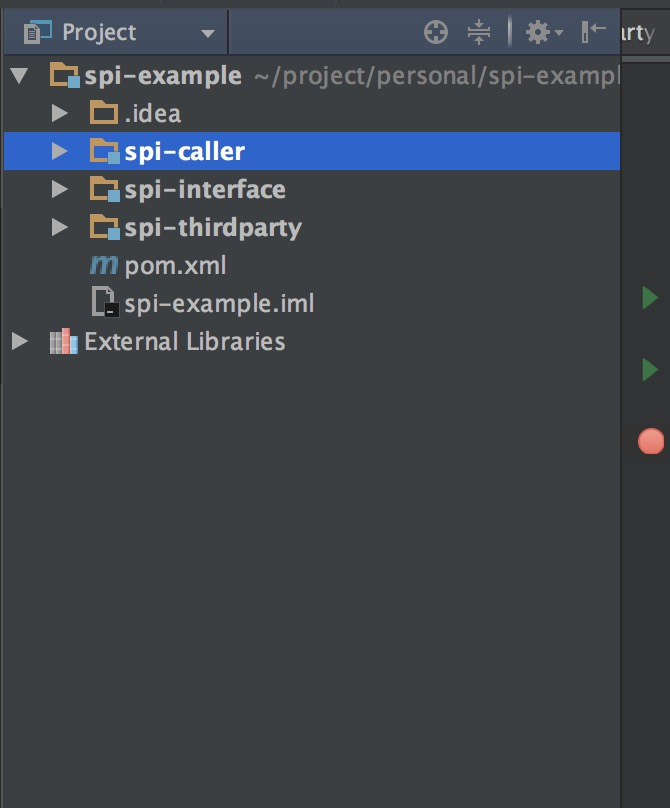

## java spi

```
java 的Spi和Api， 从某种意义上来讲Spi就是Api，通俗的讲：Api 和 Spi 都是相对的概念，他们的差别只在语义上，Api 直接被应用开发人员使用，Spi 被框架扩张人员使用。
```

## 目录

* 为什么需要SPI
* 如何实现SPI
* 总结

## 为什么需要SPI

​	一个服务(service)通常指的是已知的接口或者抽象类，服务提供方就是对这个接口或者抽象类的实现，然后按spi标准存放到资源路径META-INF/services目录下，文件的命名为该服务接口的全限定名。如有一个服务接口com.test.Service，其服务实现类为com.test.ChildService，那此时需要在META-INF/services中放置文件com.test.Service，其中的内容就为该实现类的全限定名com.test.ChildService，有多个服务实现，每一行写一个服务实现，#后面的内容为注释，并且该文件只能够是以UTF-8编码。

​	这种实现方式，感觉和我们通常的开发方式差不多，都是定义一个接口，然后子类实现父类中定义的方法，为什么要搞这么一套标准以及单独搞一个配置文件？这种方式主要是针对不同的服务提供厂商，对不同场景的提供不同的解决方案制定的一套标准，举个简单的例子，如现在的JDK中有支持音乐播放，假设只支持mp3的播放，有些厂商想在这个基础之上支持mp4的播放，有的想支持mp5，而这些厂商都是第三方厂商，如果没有提供SPI这种实现标准，那就只有修改JAVA的源代码了，那这个弊端也是显而易见的，也就是不能够随着JDK的升级而升级现在的应用了，而有了SPI标准，SUN公司只需要提供一个播放接口，在实现播放的功能上通过ServiceLoad的方式加载服务，那么第三方只需要实现这个播放接口，再按SPI标准进行打包成jar，再放到classpath下面就OK了，没有一点代码的侵入性。

## 如何实现SPI

* 创建项目

创建项目spi-example, 项目结构如下包含module ```spi-caller```, ```spi-interface```, ```spi-thirdparty```，

其中```spi-interface```是需要实现的接口, ```spi-thirdparty```是实现spi规约的第三方厂商, ```spi-caller```，

是调用方。

结构如下:



* 声明接口
   声明一个玩游戏的接口和一个游戏的model类

```java
//接口
package com.nick.spi.interfaces;

import com.nick.spi.model.Game;

/**
 * Created by nick on 2017/4/18.
 */
public interface PlayGame {

    String getGame(String name);

    String playGame(Game game);
}
```

```java
//model类
package com.nick.spi.model;

/**
 * Created by nick on 2017/4/18.
 */
public class Game {

    private String gameName;

    private String place;

    private Integer participant;

    public String getGameName() {
        return gameName;
    }

    public void setGameName(String gameName) {
        this.gameName = gameName;
    }

    public String getPlace() {
        return place;
    }

    public void setPlace(String place) {
        this.place = place;
    }

    public Integer getParticipant() {
        return participant;
    }

    public void setParticipant(Integer participant) {
        this.participant = participant;
    }
}
```

* 第三方厂商实现这个接口

```java
  package com.nick.spi.thirdparty;

  import com.nick.spi.interfaces.PlayGame;
  import com.nick.spi.model.Game;

  /**
   * Created by nick on 2017/4/18.
   */
  public class NokiaPlayGame implements PlayGame{

      public String getGame(String name) {
          return String.format("we'r playing %s", name);
      }

      public String playGame(Game game) {
          return String.format("we'r playing %s at place %s and there are %d people together",
                  game.getGameName(), game.getPlace(), game.getParticipant());
      }
  }

```

* 在第三方厂商的Resources下面创建META-INF/services文件夹, 并且在这个文件夹下面创建一个名为```com.nick.spi.interfaces.PlayGame```的文件

  文件里面的内容为第三方厂商的实现类名

```java
  com.nick.spi.thirdparty.NokiaPlayGame
```

* 实现Caller调用者

```java
package com.nick.spi.caller;

import com.nick.spi.interfaces.PlayGame;
import com.nick.spi.model.Game;

/**
 * Created by nick on 2017/4/18.
 */
public class Caller {

    private PlayGame playGame;

    public Caller(PlayGame playGame){
        this.playGame = playGame;
    }

    public void playGame(Game game){
        System.out.println(playGame.getGame("踢毽子"));
        System.out.println(playGame.playGame(game));
    }
}
```

调用类
```java
package com.nick.spi.test;

import com.nick.spi.caller.Caller;
import com.nick.spi.interfaces.PlayGame;
import com.nick.spi.model.Game;

import java.util.Iterator;
import java.util.ServiceLoader;

/**
 * Created by nick on 2017/4/18.
 */
public class CallerTest {

    public static void main(String[] args){
        ServiceLoader<PlayGame> serviceLoader = ServiceLoader.load(PlayGame.class);
        Iterator<PlayGame> it = serviceLoader.iterator();
        while(it.hasNext()){
            Game game = new Game();
            game.setPlace("南京东路");
            game.setParticipant(20);
            game.setGameName("真人cs");
            PlayGame playGame = it.next();
            Caller caller = new Caller(playGame);
            caller.playGame(game);
        }
    }
}
```
执行之后我们看到结果为:
```java

we'r playing 踢毽子
we'r playing 真人cs at place 南京东路 and there are 20 people together

Process finished with exit code 0
```

## 总结

spi在各种框架当中运用广泛, spring 的ioc也是基于spi的设计思想来实现的, dubbo里面也实现了自己的spi机制, 

一个好的框架需要扩展能力强, spi很好解决了这个问题。