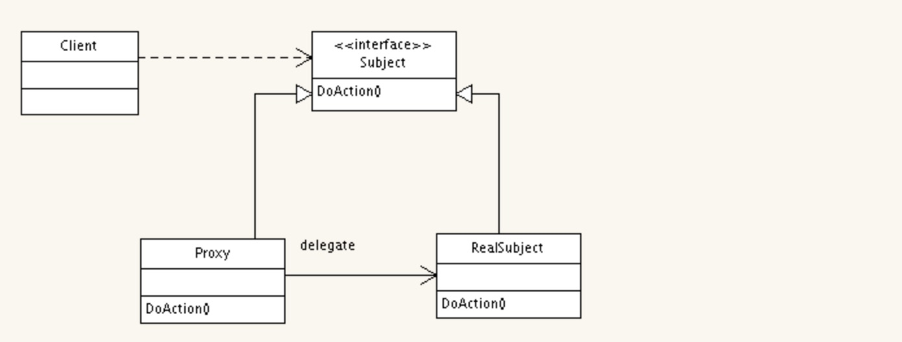

## javassist

```
Javassist是一个开源的分析、编辑和创建Java字节码的类库。

Javassist是一个开源的分析、编辑和创建Java字节码的类库。是由东京工业大学的数学和计算机科学系的 Shigeru Chiba （千叶 滋）所创建的。它已加入了开放源代码JBoss 应用服务器项目,通过使用Javassist对字节码操作为JBoss实现动态"AOP"框架。

关于java字节码的处理，目前有很多工具，如bcel，asm。不过这些都需要直接跟虚拟机指令打交道。如果你不想了解虚拟机指令，可以采用javassist。javassist是jboss的一个子项目，其主要的优点，在于简单，而且快速。直接使用java编码的形式，而不需要了解虚拟机指令，就能动态改变类的结构，或者动态生成类。

但是性能开销上面比bcel，asm这种类库更大点。
```

## 目录

* javassist和反射
* javassist如何用
* java 代理模式
* 静态代理
* 动态代理
* CGLIB


## javassist和反射

反射和javassist都是在程序运行时的操作, 但是反射无法在jvm层优化代码, 反射方法调用还有验证过程和参数问题，参数需要装箱拆箱、需要组装成Object[]形式、异常的包装等等问题,  javassist是运行时候动态生成代码, 由ClassPool来动态生成开销比反射小很多

## javassist如何用
### javassist 计算方法调用时长

```java
public class StringBuilder {

    public String buildString(int length){
        long start = System.currentTimeMillis();
        String result = "";
        for(int i=0;i<length;i++){
            result += (char)(i%26 + 'a');
        }
        System.out.println("Call to buildString took " +
                (System.currentTimeMillis()-start) + " ms.");
        return result;
    }

    public static void main(String[] args){
        StringBuilder inst = new StringBuilder();
        Integer[] argv = new Integer[]{100,2000,3000,4000};
        for (int i = 0; i < argv.length; i++) {
            String result = inst.buildString(argv[i]);
            System.out.println("Constructed string of length " +
                    result.length());
        }
    }
}
```

```java
public class JavassistTiming {

    public static void main(String[] argv) {
            try {
                String className = "com.nick.spi.javassist.StringBuilder";
                String methodName = "buildString";
                CtClass clas = ClassPool.getDefault().get(className);
                if (clas == null) {
                    System.err.println("Class " + className + " not found");
                } else {
                    addTiming(clas, methodName);
                    clas.writeFile();
                    Class cl = clas.toClass(JavassistTiming.class.getClassLoader(), JavassistTiming.class.getProtectionDomain());
                    StringBuilder stringBuilder = (StringBuilder)cl.newInstance();
                    stringBuilder.buildString(4000);
                    stringBuilder.buildString(5000);
                    System.out.println("Added timing to method " +
                            className + "." + methodName);
                }
            } catch (CannotCompileException ex) {
                ex.printStackTrace();
            } catch (NotFoundException ex) {
                ex.printStackTrace();
            } catch (IOException ex) {
                ex.printStackTrace();
            } catch (InstantiationException e) {
                e.printStackTrace();
            } catch (IllegalAccessException e) {
                e.printStackTrace();
            }
    }

    private static void addTiming(CtClass clas, String mname)
            throws NotFoundException, CannotCompileException {

        CtMethod mold = clas.getDeclaredMethod(mname);

        String nname = mname+"$impl";
        mold.setName(nname);
        CtMethod mnew = CtNewMethod.copy(mold, mname, clas, null);

        String type = mold.getReturnType().getName();
        StringBuffer body = new StringBuffer();
        body.append("{\nlong start = System.currentTimeMillis();\n");
        if (!"void".equals(type)) {
            body.append(type + " result = ");
        }
        body.append(nname + "($$);\n");

        body.append("System.out.println(\"Call to method " + mname +
                " took \" +\n (System.currentTimeMillis()-start) + " +
                "\" ms.\");\n");
        if (!"void".equals(type)) {
            body.append("return result;\n");
        }
        body.append("}");

        mnew.setBody(body.toString());
        clas.addMethod(mnew);

        System.out.println("Interceptor method body:");
        System.out.println(body.toString());
    }
}
```
## java 代理模式

### 静态代理
静态代理的UML图如下


### 代理模式和装饰器模式的区别

一般来讲代理模式和装饰器模式都是实现一个接口, 由代理对象加入实际目标对象来做到代理作用, 但是用法上面代理模式和装饰模式有区别, 装饰器模式关注于在一个对象上动态的添加方法, 然而代理模式关注于控制对对象的访问。换句话说, 用代理模式, 代理类（proxy class）可以对它的客户隐藏一个对象的具体信息。因此, 当使用代理模式的时候, 我们常常在一个代理类中创建一个对象的实例。并且, 当我们使用装饰器模式的时候, 我们通常的做法是将原始对象作为一个参数传给装饰者的构造器。

## 静态代理

直接上代码

代理模式:

```java
//抽象接口
public interface UserDao {
    void save(User user);
}
```

```java
/**
** 具体的业务逻辑
**/
public class UserDaoImpl implements UserDao {

    @Override
    public void save(User user) {
        String userProfile = String.format(" nick name is : %s with mobile %s", 			user.getNickName(), user.getMobile());
        System.out.println("save user " + userProfile);
    }
}
```

```java
/**
** 代理类
**/
public class UserDaoProxy implements UserDao {

    private UserDao userDao;

    public UserDaoProxy(){
        this.userDao = new UserDaoImpl();
    }
  
    @Override
    public void save(User user) {
        System.out.println("before save");
        userDao.save(user);
        System.out.println("after save");
    }
}
```

```java
//单元测试
public class ProxyTest {

    private User user;

    /**
     * 静态代理
     */
    @Test
    public void staticProxyTest(){
        user = new User();
        user.setAccount("qiujun4417@hotmail.com");
        user.setBirthday(new Date());
        user.setMobile("13817396997");
        user.setNickName("小白");
        user.setPassword("12345678");
        user.setUid(UUID.randomUUID().toString());
        UserDao proxy = new UserDaoProxy();
        proxy.save(user);
    }
}
```

装饰器模式:

```java
/**
*** 装饰者
**/
public class Decorator implements UserDao{

    private UserDao userDao;

    public Decorator(UserDao userDao){
        this.userDao = userDao;
    }

    @Override
    public void save(User user) {
        System.out.println("before save");
        userDao.save(user);
        System.out.println("after save");
    }
}
```

```java
	//单元测试
	@Test
    public void decoratorTest(){
        UserDao redisUserDao = new RedisUserDao();
        Decorator decorator = new Decorator(redisUserDao);
        decorator.save(user);
    }
```

## 动态代理

动态代理有以下特点:
* 代理对象,不需要实现接口

* 代理对象的生成,是利用JDK的API,动态的在内存中构建代理对象(需要我们指定创建代理对象/目标对象实现的接口的类型)

* 动态代理也叫做:JDK代理,接口代理

动态代理代码:
```java
//动态代理
public class DynamicProxyFactory {

    private Object target;
    private Aop aop;

    public DynamicProxyFactory(Object target, Aop aop){
        this.target = target;
        this.aop = aop;
    }

    public Object getProxyInstance(){
        return Proxy.newProxyInstance(target.getClass().getClassLoader(), 				target.getClass().getInterfaces(),
                (proxy, method, args) -> {
                    aop.doBefore();
                    Object backValue = method.invoke(target, args);
                    aop.doAfter();
                    return backValue;
                });
    }
}
```
## GCLIB

上面的静态代理和动态代理模式都是要求目标对象是实现一个接口的目标对象,但是有时候目标对象只是一个单独的对象,并没有实现任何的接口,这个时候就可以使用以目标对象子类的方式类实现代理,这种方法就叫做:Cglib代理

Cglib代理,也叫作子类代理,它是在内存中构建一个子类对象从而实现对目标对象功能的扩展.

* JDK的动态代理有一个限制,就是使用动态代理的对象必须实现一个或多个接口,如果想代理没有实现接口的类,就可以使用Cglib实现.
* Cglib是一个强大的高性能的代码生成包,它可以在运行期扩展java类与实现java接口.它广泛的被许多AOP的框架使用,例如Spring AOP和synaop,为他们提供方法的interception(拦截)
* Cglib包的底层是通过使用一个小而块的字节码处理框架ASM来转换字节码并生成新的类.不鼓励直接使用ASM,因为它要求你必须对JVM内部结构包括class文件的格式和指令集都很熟悉.

代码

```java
//cglib
public class CglibProxyFactory implements MethodInterceptor{

    private Object target;

    private Aop aop;

    public CglibProxyFactory(Object target, Aop aop){
        this.target = target;
        this.aop = aop;
    }

    public Object getProxyInstance(){
        Enhancer enhancer = new Enhancer();
        enhancer.setSuperclass(target.getClass());
        enhancer.setCallback(this);
        return enhancer.create();
    }

    @Override
    public Object intercept(Object obj, Method method, Object[] args, MethodProxy proxy) throws Throwable {
        aop.doBefore();
        Object returnValue = method.invoke(target, args);
        aop.doAfter();
        return returnValue;
    }
}
```
### CallbackFilter

有一个需求, 上面的代码是给所有方法都进行了拦截, 现在需要某一个方法需要拦截其他方法不拦截, 这个时候可以实现一个callbackFilter,  可以实现。

```java
/**
 * Created by nick on 2017/4/30.
 * 方法拦截器
 */
public class MethodFilter implements CallbackFilter {

    @Override
    public int accept(Method method) {
        if("delete".equalsIgnoreCase(method.getName())){
            return 0;
        }
        return 1;
    }

}
```

```java
public Object getProxyInstanceByFilter(){
        Enhancer en = new Enhancer();
        en.setSuperclass(target.getClass());
        en.setCallbacks(new Callback[]{this, NoOp.INSTANCE});
        en.setCallbackFilter(new MethodFilter());
        return en.create();
    }
```

总结:

cglib广泛的运用在各种框架当中, spring aop也是基于cglib来实现, 当目标对象是实现了接口的, 就用jdk的动态代理来实现, 当目标对象没有实现接口的, 则用cglib来扩展。